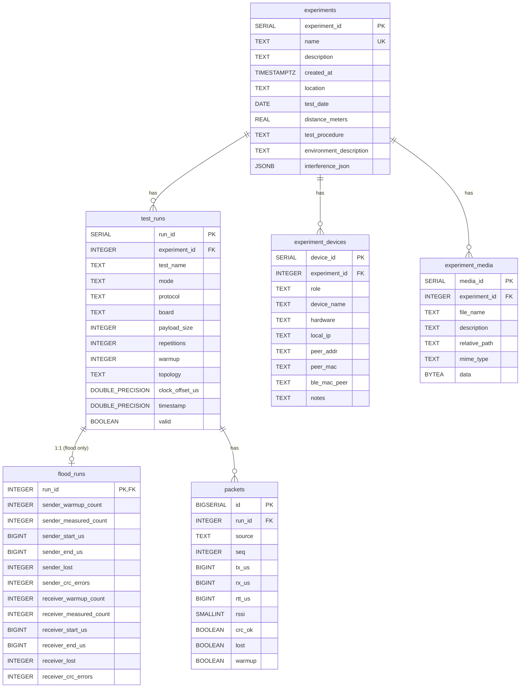

# Analysis Pipeline

Two-step workflow: **ingest** JSONL results into PostgreSQL, then **analyze** from the DB.

## Prerequisites

- PostgreSQL instance running (lab server: `10.10.7.93:5432`)
- Python package installed: `cd cpcbf && pip install -e .`

## Configuration

Set the required environment variables (`PGHOST`, `PGUSER`, `PGPASSWORD` are mandatory; `PGPORT` defaults to `5432`, `PGDATABASE` defaults to `cpcbf`):

```bash
export PGHOST=<host>
export PGPORT=5432
export PGDATABASE=cpcbf
export PGUSER=<user>
export PGPASSWORD='<password>'
```

Alternatively, set a single `DATABASE_URL`:

```bash
export DATABASE_URL='postgresql://<user>:<password>@<host>:5432/cpcbf'
```

## Step 1: Ingest

### Ingest a directory of sender/receiver files (recommended)

```bash
cpcbf-ingest results/
```

This automatically:
1. Pairs `*_sender.jsonl` and `*_receiver.jsonl` files by test name
2. Computes aggregates from both sides
3. Stores **only relevant per-packet data** based on mode:
   - **ping_pong (RTT)**: sender packets only (has `rtt_us`)
   - **rssi**: receiver packets only (has RSSI values)
   - **flood**: no packets — aggregates only
4. Loads `experiment.json` metadata if present

The experiment name defaults to the directory name.

### Ingest a merged JSONL file (legacy)

```bash
cpcbf-ingest results/results.jsonl
```

### Specify a custom experiment name

```bash
cpcbf-ingest results/ --experiment "wifi-garage-20m"
```

## Step 2: Analyze

`run_analysis.py` reads from the DB only (no ingestion). It requires `--experiment` to scope results to a single experiment and groups all output by protocol.

| Flag | Required | Description |
|------|----------|-------------|
| `--experiment` | yes | Experiment name (must already be ingested) |
| `--protocol` | no | Filter by protocol (`wifi`, `ble`, ...). Default: all protocols |
| `--output` | no | Output directory for plots/CSV. Default: `results/` |

### Run analysis

```bash
# All protocols
python -m cpcbf.analysis.run_analysis --experiment "wifi-garage-20m" --output results/

# Single protocol
python -m cpcbf.analysis.run_analysis --experiment "wifi-garage-20m" --protocol ble --output results/
```

### Console output

Stats are printed grouped by protocol:

```
══ Experiment: wifi-garage-20m ═══════════════════════════════

── wifi ──────────────────────────────────────────

  ── Ping-Pong (RTT) Results ──

  Payload   Samples   Mean(us)   Med(us)  ...
  ───────────────────────────────────────────
  32B         1000       2345      2100   ...

  ── Flood (Throughput) Results ──
  ...

  ── RSSI Summary ──
  ...

── ble ───────────────────────────────────────────

  ── Ping-Pong (RTT) Results ──
  ...
```

### Generated outputs

Plots are always separated per protocol into subdirectories:

```
results/
├── stats.csv          # All computed stats with protocol column
├── comparison.csv     # Cross-run comparison table with protocol column
├── packets.csv        # Per-packet export (scoped to experiment)
└── plots/
    ├── wifi/
    │   ├── rtt_boxplot.png
    │   ├── rtt_cdf.png
    │   ├── throughput.png
    │   ├── loss.png           # ping_pong + flood only (no rssi)
    │   └── rssi.png
    └── ble/
        ├── rtt_boxplot.png
        ├── rtt_cdf.png
        ├── throughput.png
        ├── loss.png
        └── rssi.png
```

### Quick analysis without DB (standalone)

For quick checks without PostgreSQL, use `stats_from_json.py` directly on JSONL files:

```bash
python cpcbf/analysis/stats_from_json.py results/
```

## Schema

Six tables are auto-created on first run.

### ER Diagram



### Table overview

| Table | Description |
|---|---|
| `experiments` | One row per field test + metadata (location, date, environment) |
| `test_runs` | One row per test — run config + valid flag (no aggregates) |
| `flood_runs` | 1:1 with `test_runs` for flood mode — sender/receiver aggregates |
| `packets` | Per-packet data: RTT sender packets + RSSI receiver packets only |
| `experiment_devices` | Device info per experiment (role, hardware, IP) |
| `experiment_media` | Media files per experiment — stores actual file bytes as BLOB (`data` BYTEA) |

### What gets stored per mode

| Mode | Per-packet rows | Aggregates (`flood_runs`) |
|------|----------------|---------------------------|
| **ping_pong** | Sender only (has `rtt_us`) | None |
| **rssi** | Receiver only (has `rssi`) | None |
| **flood** | None | Both sides: warmup/measured counts, time span, lost, CRC |

### Aggregate columns in `flood_runs`

Each side (sender/receiver) has:
- `*_warmup_count` — warmup packets
- `*_measured_count` — non-warmup packets
- `*_start_us` / `*_end_us` — time span of measured packets
- `*_lost` — lost packet count (measured only)
- `*_crc_errors` — CRC error count (measured only)

### Duplicate detection

Re-running ingest on the same files is safe. Duplicates are detected by the `(test_name, timestamp)` unique constraint and skipped.

### Marking invalid runs

Exclude faulty runs from analysis without deleting data:

```sql
UPDATE test_runs SET valid = FALSE WHERE run_id = 42;
```

## Experiment Metadata

Create a skeleton `experiment.json` in your results directory:

```bash
cpcbf-metadata init results/
```

Edit the generated file, then validate:

```bash
cpcbf-metadata validate results/
```

The metadata is automatically loaded during ingestion. Fields stored:
- `location`, `test_date`, `distance_meters`
- `test_procedure_description`, `environmental_description`
- `dynamic_interference` (JSON)
- `devices` (stored in `experiment_devices` table)
- `media_files` (stored in `experiment_media` table)

Fields like `technology`, `samples_per_scenario`, `measured_metrics` are **not** in the schema — they are derivable from `test_runs`.

## Querying

```bash
psql -h $PGHOST -U $PGUSER -d cpcbf
```

```sql
-- Row counts
SELECT count(*) FROM experiments;
SELECT count(*) FROM test_runs;
SELECT count(*) FROM packets;

-- Runs per experiment
SELECT e.name, count(r.run_id)
FROM experiments e
JOIN test_runs r USING (experiment_id)
WHERE r.valid = TRUE
GROUP BY e.name;

-- Packet rows per mode (flood should be 0)
SELECT r.mode, count(p.id) AS pkt_rows
FROM test_runs r
LEFT JOIN packets p ON r.run_id = p.run_id
WHERE r.valid = TRUE
GROUP BY r.mode;

-- Average RTT per payload size
SELECT r.payload_size, avg(p.rtt_us) AS avg_rtt_us
FROM test_runs r
JOIN packets p USING (run_id)
JOIN experiments e USING (experiment_id)
WHERE e.name = 'results'
  AND r.valid = TRUE
  AND p.warmup = FALSE
  AND p.source = 'sender'
  AND p.rtt_us IS NOT NULL
GROUP BY r.payload_size
ORDER BY r.payload_size;

-- Flood throughput from aggregates (JOIN flood_runs)
SELECT r.test_name, f.sender_measured_count, f.receiver_measured_count,
       f.receiver_start_us, f.receiver_end_us, f.receiver_lost, f.receiver_crc_errors
FROM test_runs r
JOIN flood_runs f ON r.run_id = f.run_id
WHERE r.mode = 'flood' AND r.valid = TRUE
LIMIT 10;

-- Media BLOBs stored
SELECT file_name, mime_type, length(data) FROM experiment_media;
```
