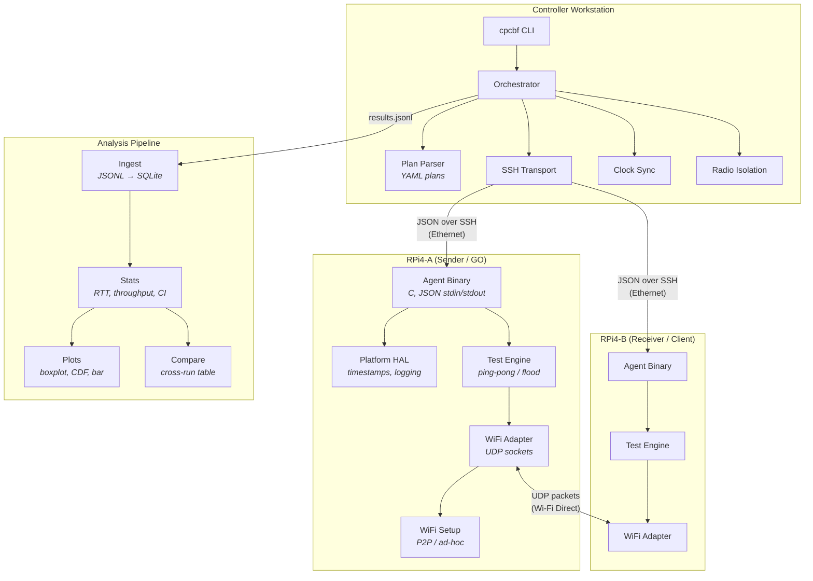
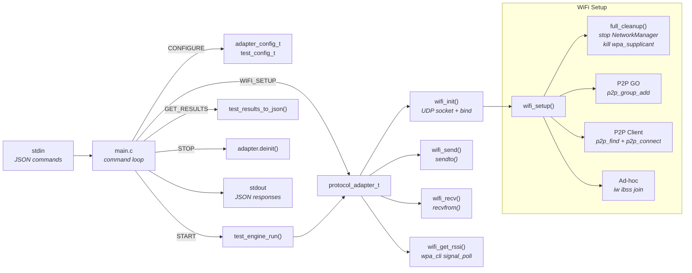
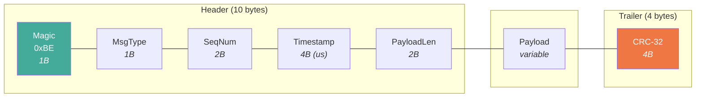
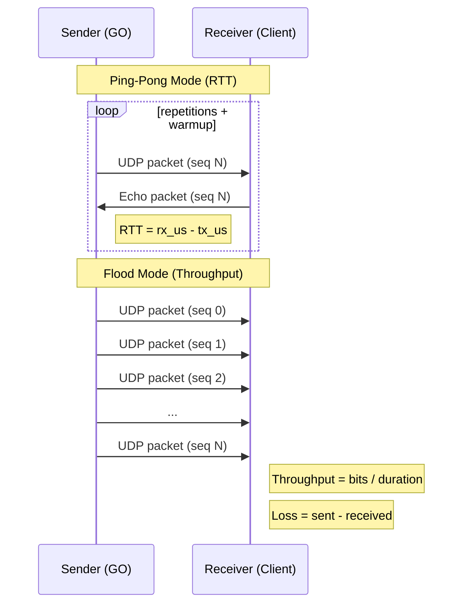
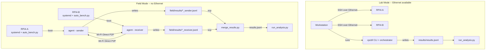
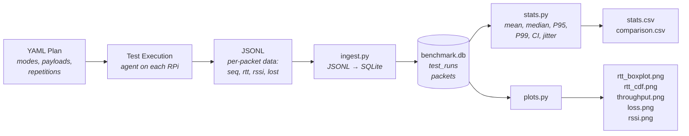
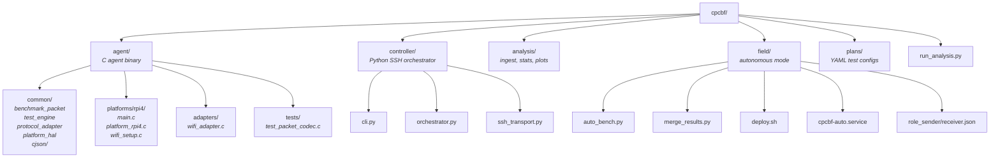

# CPCBF Architecture Diagrams

## 1. System Architecture

## 2. Agent Internal Architecture

## 3. Packet Wire Format

## 4. Test Modes

## 5. Lab Mode vs Field Mode

## 6. Data Pipeline

## 7. Project File Structure

